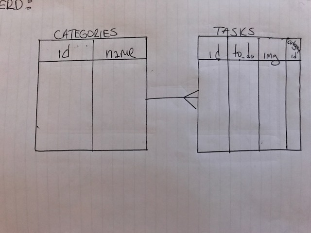
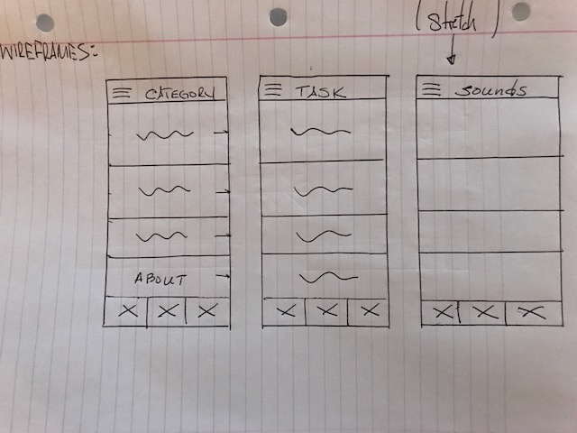

# talkNow

### Description:
April is National Autism Awareness Month! 

Talk Now is a mobile application that helps Non-verbal Autistic people communicate. Users will be able to communicate through the use of simple words and pictures within well defined lists.  The application will help with instant communication as well as progressions through daily routines. 

User Stories formed through the guidance of Joe Werderitch MS, Behavior Therapist

### Technologies used:
- JavaScript
- Xcode
- Angular.js
- Node.js
- Cordova
- HTML
- CSS
- Ionic
- Heroku
- Trello
- Git / GitHub

### User stories:
[Trello](https://trello.com/b/lw7A83Q7/talk-now)

### ERD:

### Wireframes:

### Link to application:
- Coming Soon!

### Approach taken:
- Coming Soon!

### Installation instructions:
- Coming Soon!

### Unsolved problems and next steps:
- Coming Soon!
