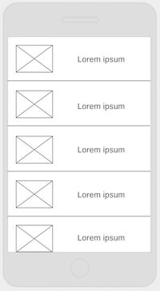
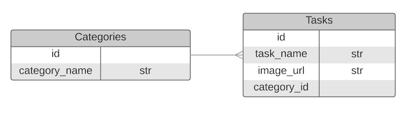

# talkNow

### Description:
April is National Autism Awareness Month! 

Talk Now is a mobile application that helps Non-verbal Autistic people communicate. Users will be able to communicate through the use of simple words and pictures within well defined lists.  The application will help with instant communication as well as progressions through daily routines. 

User Stories formed through the guidance of Joe Werderitch MS, Behavior Therapist

### Technologies used:
 
 
 
 
 
 
 

### User stories:
[talkNow User Stories on Trello](https://trello.com/b/lw7A83Q7/talk-now)

### Wireframes:

### ERD:

### Link to application:
Back-End: https://pacific-tundra-10462.herokuapp.com/tasks
Front-End: Coming soon to App Store!

### Approach taken:
1. Setup ionic sidemenu
2. Created backend API
3. Seeded database with basic data
4. Modified states for desired layout
5. Styled application and added text

### Installation instructions:
1. Download Ionic View -> App Store
2. Download TalkNow directory -> GitHub
3. Install ionic -> Terminal "npm install -g cordova ionic"
4. Inside TalkNow directory -> Terminal "ionic upload"
5. Open Ionic View -> TalkNow application -> View App

### Unsolved problems and next steps:
- Matching icons library
- Seed more data then create category menu
- Create additional steps menu for certain categories
- Implement awards page from my stretch goals options
- Learn more about SASS

### Known bugs:
- Currently clean!
